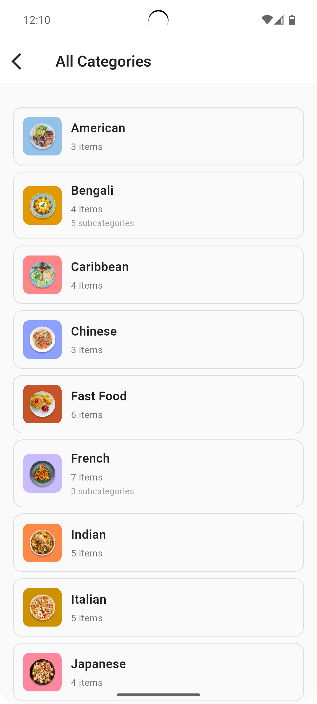

# Foodie Spot

**Foodie Spot** is a responsive Flutter app (v3.32.4) developed with Android Studio (Koala), designed to help users discover restaurants and food items based on their location, preferences, and popularity. The project includes API data fetching, filtering, and a clean, mobile-first UI optimized for both mobile and web platforms.

---

## Features

- Splash screen with clean branding
- Dashboard UI with intuitive navigation
- Restaurant and food search by name or keyword
- Product and restaurant description pages with images and ratings
- Category screen to browse food types
- Popular nearby food discovery
- Food campaign page for promotions
- Restaurant list with pagination support
- Filtering and sorting by rating, distance, price, cuisine
- Responsive UI compatible with mobile and web
- Proper error handling for network and API failures
- Clean state management implementation

---

## UI Previews

  
**Splash Screen**

<br>

  
**Dashboard**

<br>

  
**Search Restaurant/Food**

<br>

  
**Restaurant Details**

<br>

  
**Banner Details**

<br>

  
**Categories**

<br>

  
**Food Campaign**

<br>

  
**Restaurants Food Filtering**

<br>

  
**Dashboard Web**

<br>

  
**Search Restaurant/Food Web**

<br>

---

## Getting Started

### Prerequisites

- Flutter SDK version 3.32.4
- Android Studio Koala
- Dart SDK (bundled with Flutter)
- Android emulator or physical device for mobile
- Chrome or Edge for web testing

### Clone the Repository

```bash
git clone https://github.com/IftikharSikder/foodie-spot.git
cd foodie-spot
